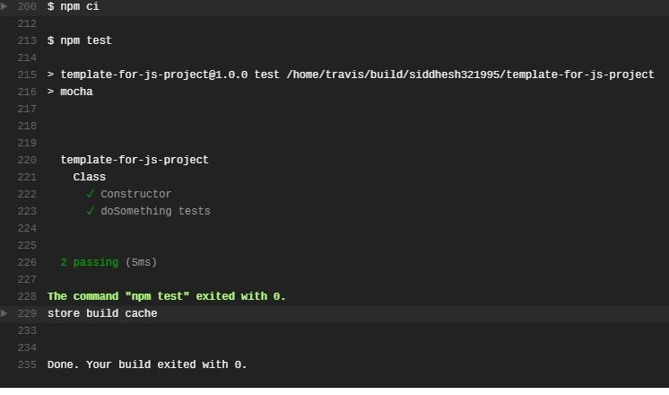
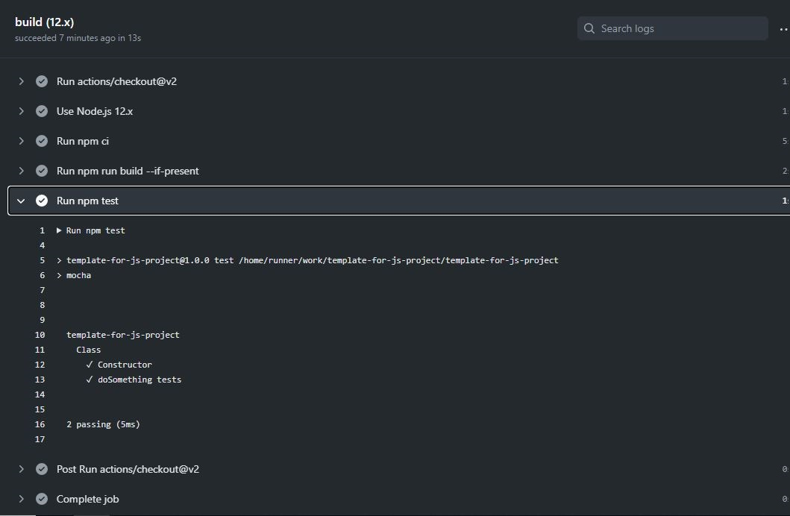
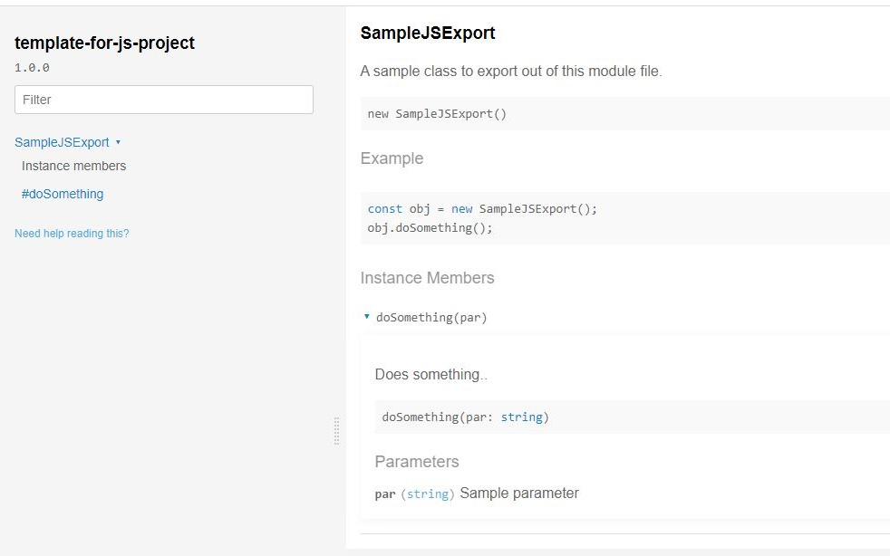

# Template for your javascript project
This is a sample template for your javascript app, it contains predefined Unit testing with Mocha, travis for build info, Automatic Documentation with documentation npm library, Github workflow files, gitignore, Read me and many more.

## Unit Tests and Auto generating documentation

> Travis-ci build, Get  this cool looking badge on [travis-ci.com](https://travis-ci.com)

> Github Actions - Node build

> Autogenerating documenation for your code.

## Steps to get started with creating cool JavaScript applications
1. Clone/Fork this repository.
1. Find and replace all instances of "siddhesh321995" with your username on Github.
1. Find and replace all instances of "template-for-js-project" with your repository name on Github.
1. You will need mocha installed for unit testing, install it using `npm install -g mocha`.
1. You will also need babel, browserify for converting your code from ES6 to ES5, install it using `npm install -g @babel/core @babel/cli` and then `npm install -g browserify`.
1. You can install uglifyjs to minify your js output, install it using `npm install uglify-js -g`.
1. After installing the global packages, run `npm install` to install local development packages.
1. By default your entry point is `src/index.js` and output directory is dist/.
1. Now you are good to go!! Now its time for code, **build, test, doc** and repeat!!
1. Build : Add your code in `src/index.js` and run `npm run build` command to generate output files in dist/.
1. Test: Add unit tests in `test.js` files and run `npm run test` command to run unit tests with mocha.
1. Doc: Finally generate html files (docs/) and [DOCUMENTATION.md](DOCUMENTATION.md) files automatically using `npm run doc` command.

## Complete Documentation
Checkout [DOCUMENTATION.md](DOCUMENTATION.md) for complete documentation or View Documentation online at [https://siddhesh321995.github.io/template-for-js-project/](https://siddhesh321995.github.io/template-for-js-project/)

## Contributing:
Let me know in issues/github page or on email which javascript functions to include in next release.
Check all the [Contributing authors](CONTRIBUTING.md) to this library.